# Introduction

The [LWB+/LWB5+ Orion](https://www.futureelectronics.com/future-development-boards/orion) board, developed by Future Electronics, is specifically engineered for
seamless integration with the Nucleo-144 form factor board. With 144 pin headers, the Orion board can be easily connected to the STM32 Nucleo board without requiring any hardware
modifications. Additionally, it provides a MikroBUS interface for peripheral expansion.

In the accompanying images, we see the [Nucleo-H723ZG](https://www.st.com/en/evaluation-tools/nucleo-h723zg.html) with a Nucleo-144 adapter on the left
and the Orion board positioned atop it on the right.

[](images/1-orion-board.png)


This guide demonstrates the configuration of the LWB+/LWB5+ Orion board on
STM32CubeIDE and the execution of various Wi-Fi/BT applications on [Nucleo-H723ZG](https://www.st.com/en/evaluation-tools/nucleo-h723zg.html) using
FreeRTOS. The specific example provided in this tutorial pertains to LWB5+. If you intend to
use LWB+, simply substitute "LWB5plus" with "LWBplus."

# Prerequisites

The following software needs to be installed:

- Visit https://github.com/Infineon/AIROC-Wi-Fi-Bluetooth-STM32/releases and download Infineon.AIROC-Wi-Fi-Bluetooth-STM32.1.5.1.pack for Infineon Expansion pack. 
- To download demo applications, click **View raw** on the links below:


- [Nucleo-H7232ZG-LWB5plus_ver.1.0.zip](https://github.com/neilch0811/Future_Orion/blob/main/Nucleo-H7232ZG-LWB5plus_ver.1.0.zip) (CYW4373/E)
- [Nucleo-H7232ZG-LWBplus_ver.1.0.zip](https://github.com/neilch0811/Future_Orion/blob/main/Nucleo-H7232ZG-LWBplus_ver.1.0.zip) (CYW43439)

> **Note:** Extract the zip files to "C:\Users\%USERNAME%\STM32Cube\Example". It's possible to
select an alternative path, but if the project folder path is excessively long, it may cause issues during app compilation.


- [STM32CubeMX](https://www.st.com/en/development-tools/stm32cubemx.html) is a tool used to generate code by integrating STM32 platform firmware
    and additional packages.
- [STM32CubeIDE](https://www.st.com/en/development-tools/stm32cubeide.html) serves as an IDE for compiling applications, flashing them to
    STM32xx, and debugging via the ST-Link (JTAG-like debug interface).
- [STM32CubeProgrammer](https://www.st.com/en/development-tools/stm32cubeprog.html) is a tool designed for flashing binary files of applications onto
    STM32 boards.
- The following are accessory software required when running specific demo applications:
	- [Iperf v2.x](https://iperf.fr/iperf-download.php): This is necessary when running the wifi_bt_tester application.
	- **AIROC Bluetooth Connect App** provided by Infineon: This app is essential for
       running the ble_hello_sensor application.


[](images/2-airoc-bluetooth-connect-qr.png)

# Configure STM32 software packages

## Install STM32 Connectivity Expansion Pack v1.5.

The expansion pack consists of embedded software packages that complement STM32Cube
MCU packages with additional software bricks provided by Infineon. To begin, open
STM32CubeMx and select **Install/Remove** under **Manage Software Installation**.

[](images/3-mx-overview.png)


Select **From Local** and proceed to open the pack file. Once located, ensure the box is checked
and proceed with installing the package.

[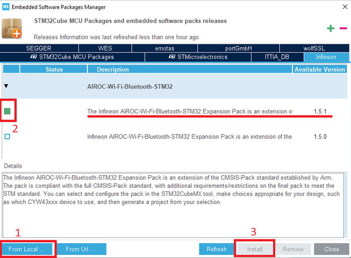](images/4-mx-pack-install.png)


Close STM32CubeMx.

## Patch for the expansion pack v1.5.

The **Nucleo-H7232ZG-LWBplus_ver.1.0** folder contains two files that require replacement.
The first file, **Infineon.AIROC-Wi-Fi-Bluetooth-STM32.pdsc**, is an XML-based package
description file that outlines the contents of the software pack and provides usage context
information for the included files. The second file, **Infineon.AIROC-Wi-Fi-Bluetooth-STM32.1.5.1_Configs.xml**, holds settings, parameters, and options for the expansion pack.

To adapt to a change for LWB+/LWB5+, users will need to replace the original files generated
below during installation of the expansion pack:

- C:\Users\%USERNAME%\STM32Cube\Repository\Packs\Infineon\AIROC-Wi-Fi-
    Bluetooth- STM32\1.5.1\Infineon.AIROC-Wi-Fi-Bluetooth-STM32.pdsc
- C:\Users\%USERNAME%\STM32Cube\Repository\Packs\Infineon\AIROC-Wi-Fi-
    Bluetooth- STM32\1.5.1\STM32CubeMX\Infineon.AIROC-Wi-Fi-Bluetooth-STM32.1.5.1_Configs.xml

> **Note:** For this demo, no modification is needed for configuration and source code. In the future, if you
want to make your own application by leveraging existing sample applications, do not edit the
sample applications under “Repository” directory. Keep them as master. Rather, copy an app, for
example, from

> - C:\Users\%USERNAME%\STM32Cube\Repository\Packs\Infineon\AIROC-Wi-Fi-
    Bluetooth- STM32\1.5.1\Projects\NUCLEO-H563ZI\Applications\wifi_bt_tester

> to

> - C:\Users\%USERNAME%\STM32Cube\Example

# Open/build/flash application

## Open a project

.ioc file contains initialization settings and allows you to set up parameters and generate C code.
Open ioc file in the following path, for example.

- C:\Users\%USERNAME%\STM32Cube\Example\Nucleo-H7232ZG-LWB5plus\wifi_bt_tester

The below pop-up may appear if CubeMx version is newer than one with which .ioc file was
created. When the version of CubeMX is upgraded, the version of ST’s firmware for their
STM32xxx chip is also upgraded.

- "Migrate” is to use newer version of STM32xxx firmware.
- “Continue” is to keep original version of STM32xxx firmware.


In general, the version of STM32 chip firmware does not have impact on functionality of Wi-
Fi/BT application. In our case, we will select **Migrate**.

[](images/5-mx-firmware-mismatch.png)

Generate Code

[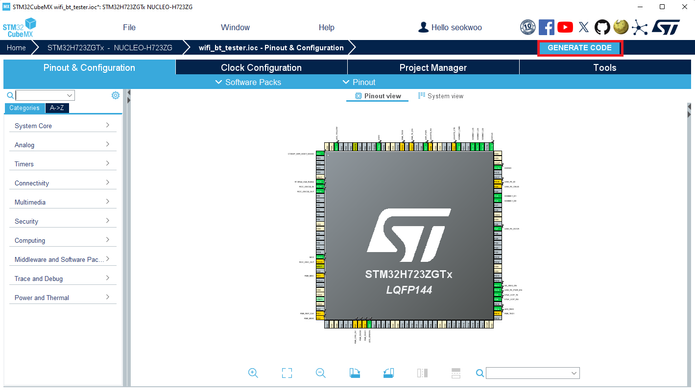](images/6-generate-code.png)


Open project upon successful code generation.

[](images/7-open-project.png)


Choose default folder for workspace and launch.

[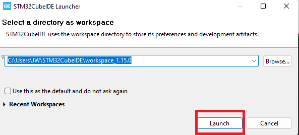](images/8-select-workspace.png)


## STM32CubeIDE: Project Explorer Overview

[](images/9-cubeide-project-explorer.png)

## STM32CubeIDE: Build Project

[](images/10-cubeide-build-project.png)

Upon successful build, .elf file should be created under Debug folder

[](images/11-cubeide-elf.png)

## STM32CubeIDE: Flash Image (.elf file) to Target Board

Plug in Nucleo board to PC and check if it is recognized as **STLINK Virtual COM port** in
device manager.

[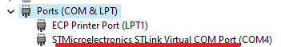](images/12-device-manager.png)

Flash by following the below instruction in order.

[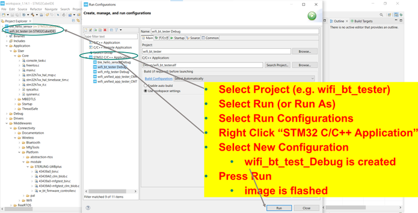](images/13-cubeide-flash.png)


# Test wifi_mfg_tester application with Teraterm

Configure serial port and new-line receive to **AUTO**.

[](images/14-teraterm-serial-setup.png)

[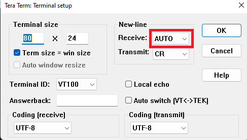](images/15-terateram-newline-auto.png)

Power cycle the board and it will initialize Wi-Fi module.

[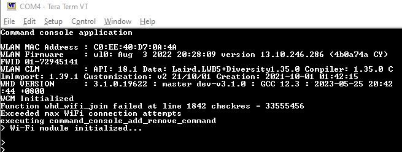](images/16-teraterm-init.png)

**help** lists all the available commands.

[](images/17-teraterm-help.png)

Connect to AP by using **join** command and do **iperf** test. Another device (e.g., computer) should
have iperf v2 running as a server. (iperf -s)

[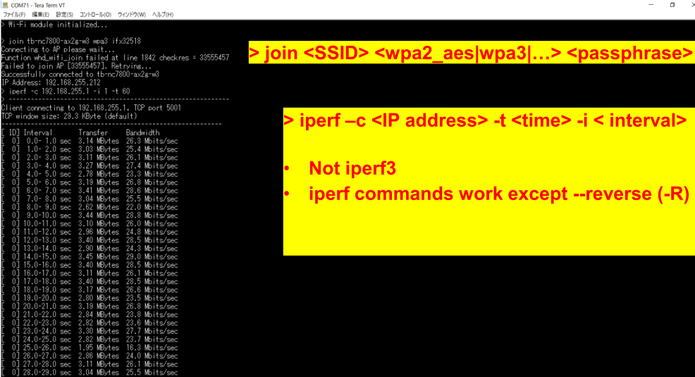](images/18-teraterm-join-iperf.png)


# Test ble_hello_sensor application

Similarly, you can open ble_hello_sensor.ioc, generate code in STM32CubeMx, build/flash the
app in STM32CubeIDE. When the application runs after power cycle, launch **AIROC Bluetooth
Connect App** and choose **hello** in the scan list. Then, you can browse through different GATT
services and read values for data.

[](images/19-ble_hello_sensor.png)

[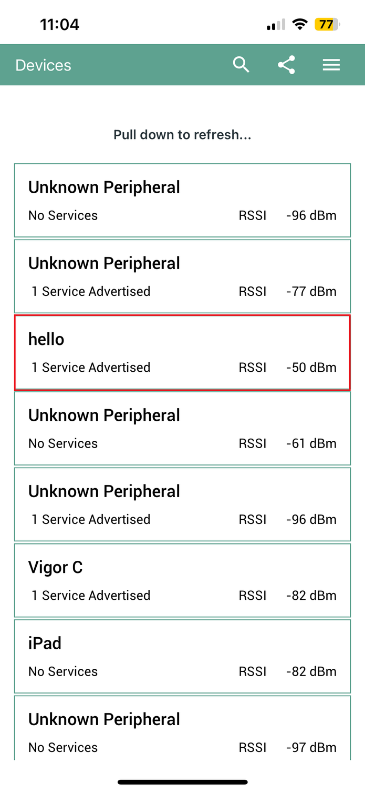](images/20-ble_hello_sensor-app.png)


# Test wifi_mfg_tester application

Similarly, you can program the wifi_mfg_tester application for the Nucleo-H723ZG and then
power cycle the device. It's important to close Teraterm at this point, as the COM port needs to
be available for use by WL tool.

To begin, navigate to C:\Users\%USERNAME%\STM32Cube\Example\Nucleo-H7232ZG-LWB5plus\wifi_mfg_tester\wl-tool-bin and enter commands in the following format: 

```wl --serial <COM_port> <command>```

Additionally, there is a help menu available: ```wl --serial <COM_port> help```, which will display
information similar to this.

[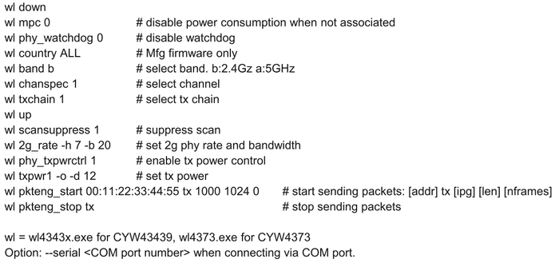](images/21-wifi_mfg_tester-help.png)

Refer to the below for example commands.

[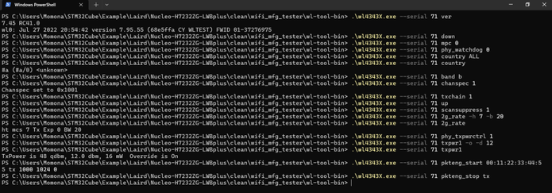](images/22-wifi_mfg_tester-examples.png)

# Reference

# STM32 Extension Pack overview

## Middleware

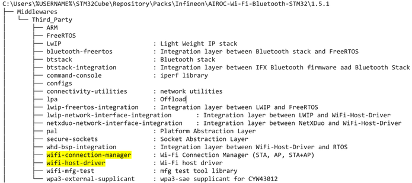

## wifi-host-driver

[](images/24-pack-overview-wifi-host-driver.png)


## Sample Applications

[](images/25-pack-overview-sample-apps.png)

# STM32CubeMx overview

In provided sample projects, everything is configured in advance. No need to modify them.

For informational purpose, the following slides explain essential configurations.

- Select Software Packs Components
- Select Device and Module
- Configure Connectivity for SDIO and BT-UART. Configure Low Power Timer for BT
- Configure GPIO for Wi-Fi/BT Enable, SDIO OOB interrupt
- Configure Clock
- etc

## Select Software Packs Component

[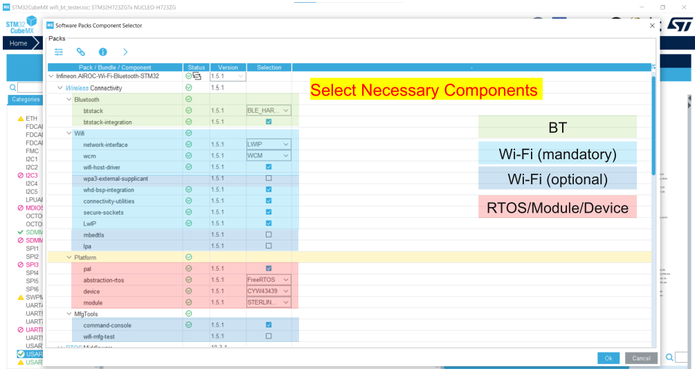](images/26-ref-software-packs.png)


## Select Device/Module

Select device/module in project file.

[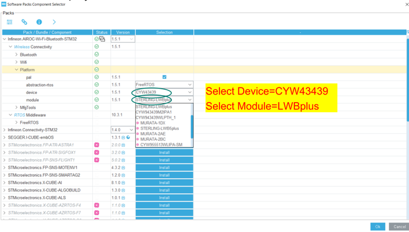](images/27-ref-device-module.png)

## Connectivity: SDMMC Configuration for SDIO

[](images/28-ef-SDMMC-config.png)


## Connectivity: UART/USART Configuration for BT

[](images/29-ref-UART-config.png)

## Timer: Low Power Timer Configuration for BT

[](images/30-ref-low-power-timer-config.png)


## GPIO Configurations

[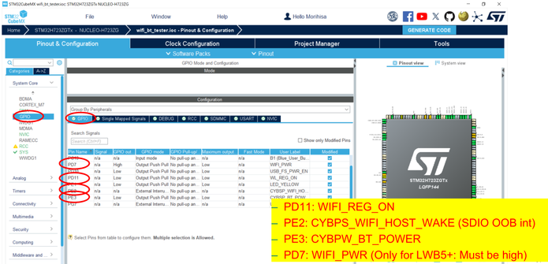](images/31-gpio-config.png)

## NVIC Configuration (for SDIO OOB interrupt)

[](images/32-ref-nvic-config.png)


## AIROC-Wi-Fi-Bluetooth-STM32 Configurations

[](images/33-ref-airoc-wifi-bt-stm32.png)

## Clock Configuration: SDIO, UART, LPTIM

[](images/34-ref-clock-config.png)

## Project Manager

[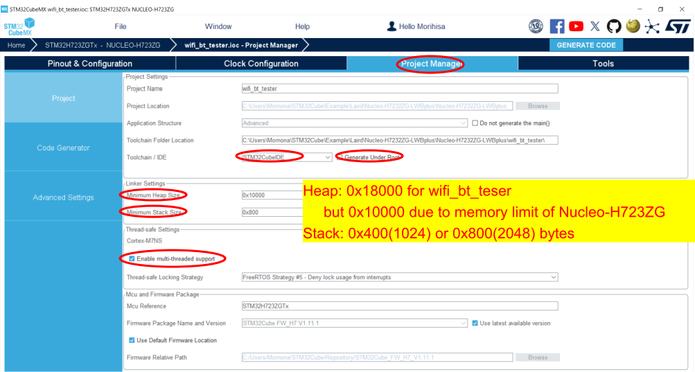](images/35-ref-project-manager.png)


## Project Manager: Advanced Settings

# STM32CubeIDE overview

## STM32CubeIDE: Properties->C/C++ Build->Settings->Preprocessor

[](images/36-ref-project-manager-advanced.png)


## STM32CubeIDE: Properties->C/C++General/Path and Symbols

[](images/37-ref-macro.png)

# Flash image (.elf/.hex) via STM32CubeProgrammer

Launch STM32CubeProgrammer and click Connect while the Orion board is connected.

[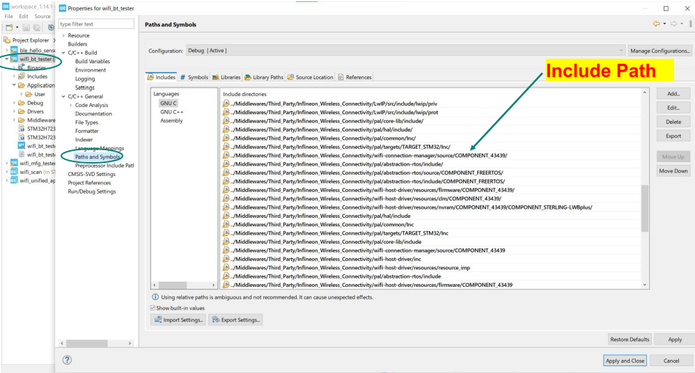](images/38-ref-path.png)

Open file.

[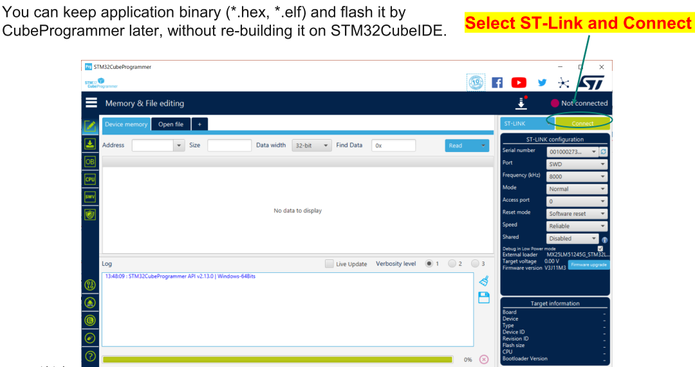](images/39-ref-programmer-connect.png)

Download

[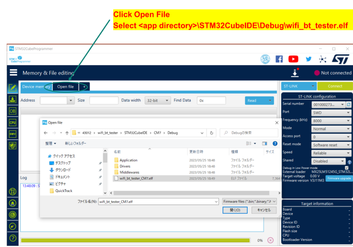](images/40-ref-programmer-open-file.png)

Disconnect

[](images/41-ref-programmer-download.png)


